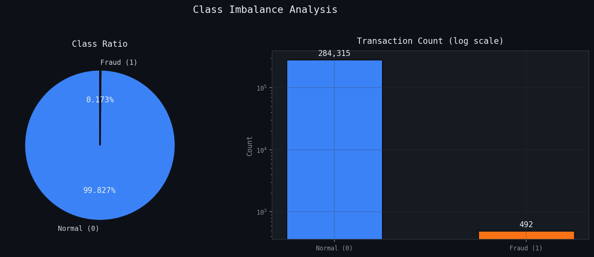
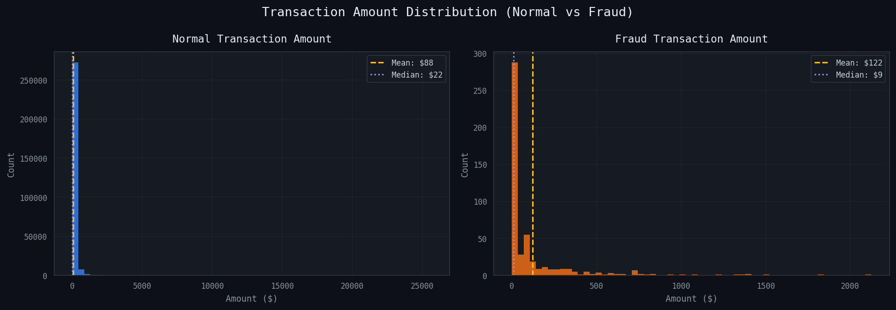
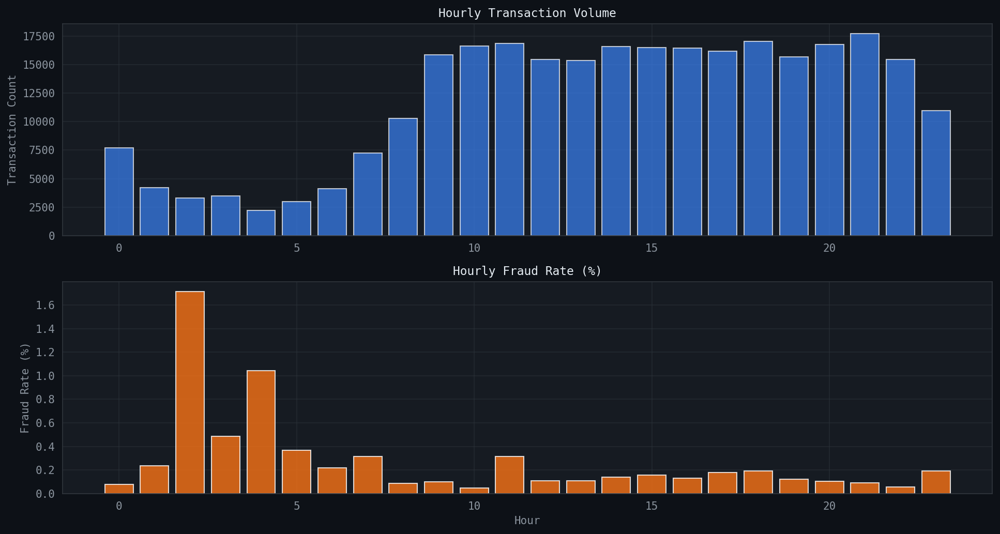
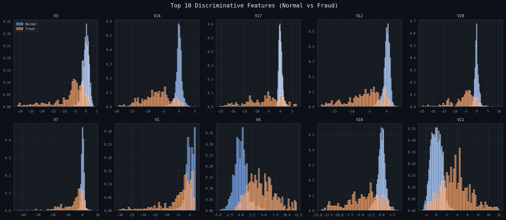
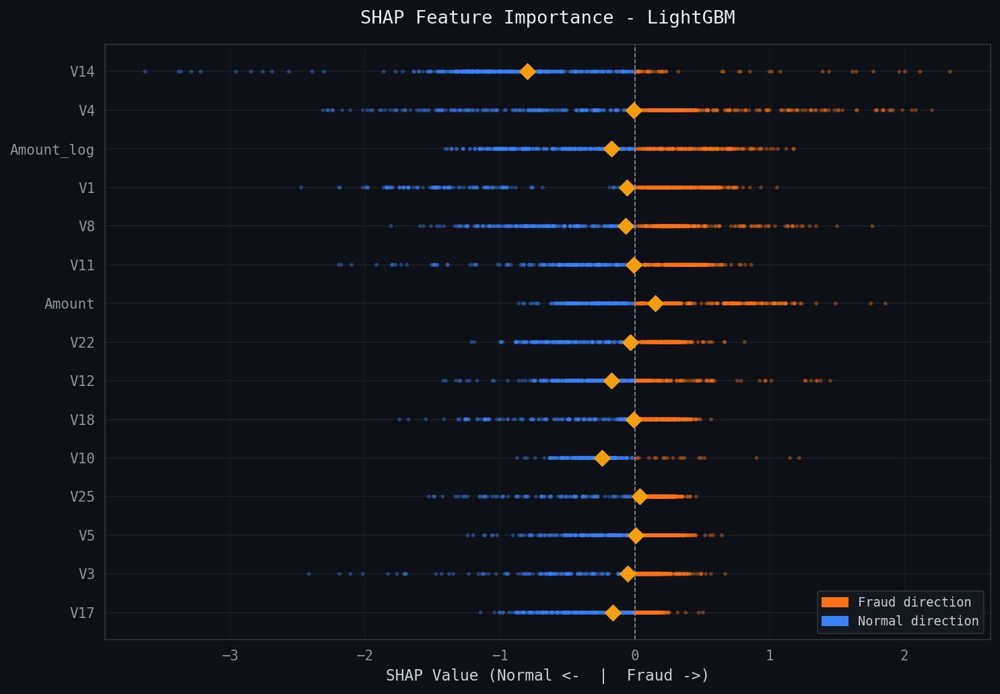
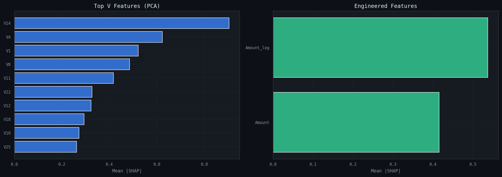

# Credit Card Fraud Detection — ML Pipeline

> **금융 도메인 MLE 포트폴리오** | 신용카드 사기 탐지 프로덕션급 ML 파이프라인

[](https://python.org)
[](https://scikit-learn.org)
[](https://mlflow.org)
[](https://xgboost.readthedocs.io)
[](https://shap.readthedocs.io)

---

## 프로젝트 개요

유럽 카드사의 실거래 284,807건을 분석해 **0.17%에 불과한 사기 거래를 탐지**하는 ML 파이프라인입니다.

단순 모델 학습을 넘어 **프로덕션 환경을 의식한 설계**에 집중했습니다.
- Config 기반 실험 관리 (하드코딩 없음)
- MLflow 실험 추적 (재현 가능한 실험)
- sklearn Pipeline으로 train/test leakage 방지
- SHAP 기반 모델 해석 (규제 대응 가능)
- 비즈니스 임팩트 정량화

---

## 핵심 결과

### 최종 테스트 성능

최종 선택 모델은 **LightGBM**입니다. 검증 세트에서 선택한 임계값 `0.8682`를 테스트 세트에 그대로 적용했습니다.

| 모델 | ROC-AUC | Average Precision | F1 | Precision | Recall | TP | FP | FN | TN |
|------|--------:|------------------:|---:|----------:|-------:|---:|---:|---:|---:|
| LightGBM | 0.9698 | 0.8102 | 0.8276 | 0.9114 | 0.7579 | 72 | 7 | 23 | 56,644 |

- 테스트 세트 사기 거래 95건 중 **72건 탐지**
- 정상 거래 56,651건 중 **7건만 오탐**
- 오탐율(False Alarm Rate): **0.0124%**

### 검증 세트 모델 비교

MLflow에 기록된 검증 세트 기준 비교입니다. 모델 선택에는 불균형 분류에 더 적합한 **Average Precision**을 주 지표로 사용했습니다.

| 모델 | ROC-AUC | Average Precision | F1 | Precision | Recall | False Alarm Rate |
|------|--------:|------------------:|---:|----------:|-------:|-----------------:|
| LightGBM | 0.9973 | 0.9139 | 0.9333 | 0.9767 | 0.8936 | 0.0035% |
| XGBoost | 0.9982 | 0.8946 | 0.9011 | 0.9318 | 0.8723 | 0.0106% |
| Random Forest | 0.9926 | 0.8604 | 0.8817 | 0.8913 | 0.8723 | 0.0177% |
| Logistic Regression | 0.9937 | 0.8610 | 0.8696 | 0.8889 | 0.8511 | 0.0177% |

> 불균형 데이터에서 ROC-AUC는 과대평가될 수 있습니다.  
> 이 프로젝트는 **Average Precision**, **Recall**, **False Alarm Rate**를 함께 보고 모델을 선택합니다.

---

## 데이터 분석 결과

### 1. 데이터 개요

사용 데이터는 Kaggle Credit Card Fraud Detection 데이터셋입니다.

| 항목 | 값 |
|------|---:|
| 전체 거래 수 | 284,807 |
| 정상 거래 | 284,315 |
| 사기 거래 | 492 |
| 사기 비율 | 0.1727% |
| 결측치 | 0 |
| 중복 행 | 1,081 |



사기 거래는 전체의 **0.17%** 뿐입니다. 따라서 단순 정확도는 의미가 거의 없습니다. 모든 거래를 정상으로 예측해도 정확도는 약 **99.83%** 가 나오기 때문입니다.

### 2. 거래 금액 분석

| 지표 | 정상 거래 | 사기 거래 |
|------|----------:|----------:|
| 평균 금액 | $88.29 | $122.21 |
| 중앙값 | $22.00 | $9.25 |



사기 거래는 평균 금액이 정상 거래보다 높지만, 중앙값은 더 낮습니다. 일부 고액 사기 거래가 평균을 끌어올리고 있으며, 금액 분포가 강하게 치우쳐 있어 `log1p` 변환을 적용했습니다.

### 3. 시간대별 패턴



시간대별 사기율은 일정하지 않았습니다. 가장 높은 사기율은 **2시**에 관찰됐고, 해당 시간대의 사기율은 **1.7127%** 였습니다. 이를 바탕으로 `Hour`, `IsNight` 파생 피처를 생성했습니다.

### 4. 주요 판별 피처



정상 거래와 사기 거래의 분포 차이가 큰 PCA 피처들이 확인됐습니다. 특히 `V3`, `V14`, `V17`, `V12`, `V10`, `V7` 등이 사기 탐지에 유용한 신호를 보였습니다.

### 5. 모델 해석 결과



SHAP 분석 결과, `V14`, `V4`, `Amount_log`, `V1`, `V8` 등이 LightGBM 예측에 크게 기여했습니다. 원본 PCA 피처뿐 아니라 `Amount_log` 같은 엔지니어링 피처도 의미 있는 기여를 했습니다.



---

## 프로젝트 구조

```
Credit-Fraud/
│
├── notebooks/
│   ├── 01_EDA.ipynb              # 탐색적 데이터 분석
│   ├── 02_Modeling.ipynb         # 모델링 & 실험 관리
│   └── 03_Interpretation.ipynb   # SHAP 기반 모델 해석
│
├── src/
│   ├── data_loader.py            # 데이터 로드 & 검증
│   ├── preprocess.py             # sklearn Pipeline 전처리
│   ├── train.py                  # MLflow 실험 추적 학습
│   ├── evaluate.py               # 불균형 분류 평가 지표
│   ├── explain.py                # SHAP 해석
│   ├── visualize.py              # 포트폴리오급 시각화
│   └── utils.py                  # 공통 유틸리티
│
├── configs/
│   └── config.yaml               # 모든 하이퍼파라미터 중앙 관리
│
├── outputs/
│   ├── models/                   # 학습된 모델 (.pkl)
│   ├── figures/                  # 시각화 결과
│   └── reports/                  # 평가 리포트 (.json)
│
├── mlruns/                       # MLflow 실험 로그
├── data/README.md                # 데이터 다운로드 안내
├── requirements.txt
└── README.md
```

---

## 설계 철학

### 1. Config 기반 실험 관리
모든 하이퍼파라미터를 `configs/config.yaml` 한 곳에서 관리합니다.
코드 수정 없이 파라미터만 바꿔서 실험 가능합니다.

```yaml
imbalance:
  strategy: "smote"    # smote | adasyn | class_weight | none
  sampling_ratio: 0.1  # 이것만 바꿔서 다양한 실험 가능
```

### 2. MLflow 실험 추적
```bash
mlflow ui  # http://localhost:5000
```
모든 실험의 파라미터, 지표, 모델이 자동 기록됩니다.  
6개월 후에도 "그 실험 어떻게 했더라?" 가 해결됩니다.

### 3. 불균형 데이터 평가
```
ROC-AUC  → 과대평가됨 (불균형 데이터에서 항상 높게 나옴)
Average Precision → 실제 탐지 성능을 정확히 반영  ← 주 지표
```

### 4. SHAP 기반 해석
```python
# 왜 이 거래가 사기로 판단됐는가?
shap_values = explainer.shap_values(transaction)
# → V14가 +0.43으로 가장 크게 기여
# → Amount_log가 +0.21로 두 번째 기여
```
금융 규제(금융소비자보호법) 상 AI 결정의 설명 의무에 대응합니다.

---

## 실행 방법

### 환경 설정
```bash
git clone https://github.com/YOUR_ID/Credit-Fraud
cd Credit-Fraud

conda create -n credit-fraud python=3.10 -y
conda activate credit-fraud
conda install -c conda-forge numba llvmlite -y
pip install -r requirements.txt
```

### 데이터 준비
```bash
# Kaggle에서 다운로드 후
mv creditcard.csv data/

# 또는 데모 데이터로 바로 실행 (자동 생성)
```

### 노트북 실행
```bash
jupyter lab
# notebooks/ 폴더에서 순서대로 실행
# 01_EDA → 02_Modeling → 03_Interpretation
```

### MLflow UI
```bash
mlflow ui
# http://localhost:5000 에서 실험 결과 확인
```

학습 로그는 프로젝트 루트의 `mlruns/`에 저장됩니다. 노트북에서 실행해도 동일한 위치를 사용하도록 `src/train.py`에서 경로를 프로젝트 루트 기준으로 고정했습니다.

---

## 기술 스택

| 분류 | 기술 |
|------|------|
| 언어 | Python 3.10 |
| ML | scikit-learn, XGBoost, LightGBM |
| 불균형 처리 | imbalanced-learn (SMOTE, ADASYN) |
| 실험 관리 | MLflow |
| 모델 해석 | SHAP |
| 시각화 | Matplotlib |
| 설정 관리 | PyYAML |

---

## 학습한 것들

1. **불균형 분류에서 올바른 평가 지표 선택** — AUC만 보면 속는다
2. **SMOTE의 한계** — 검증 세트에는 적용하면 안 된다 (leakage)
3. **임계값 최적화** — 0.5가 항상 최적이 아니다
4. **MLflow로 실험 재현** — "저번에 잘 됐던 그 실험" 을 다시 찾을 수 있다
5. **SHAP으로 모델 신뢰성 확보** — 블랙박스 모델도 설명 가능하다

---

## 데이터 출처

- **Kaggle**: [Credit Card Fraud Detection](https://www.kaggle.com/datasets/mlg-ulb/creditcardfraud)
- **원본 연구**: Dal Pozzolo et al. (2015), Worldline & ULB Machine Learning Group
- **라이선스**: Database: Open Database License (ODbL)

## 모델 데시보드
- **데시보드**: [Credit Card Fraud Detection](http://127.0.0.1:5000/#/compare-experiments/s?experiments=%5B%220%22%2C%22584662656977446303%22%5D&searchFilter=&orderByKey=attributes.start_time&orderByAsc=false&startTime=ALL&lifecycleFilter=Active&modelVersionFilter=All+Runs&datasetsFilter=W10%3D&compareRunsMode=CHART)
